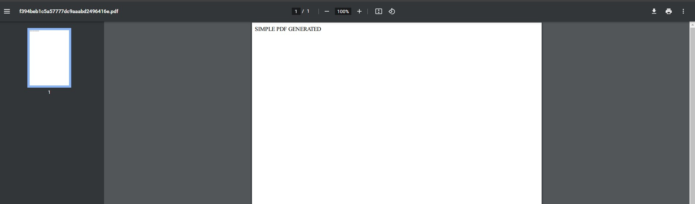

# UMA APLICAÇÃO SIMPLES PARA GERAR PDFS A PARTIR DE UM ARQUIVO HTML

Esta é um aplicação simples que gera arquivos PDF partir de um arquivo HTML.

As tecnologias utilizadas foram:

- `Node.js`
- `html-pdf`

## COMO FUNCIONA?

Inicialmente instale as dependências: `yarn install` ou `npm install`

Depois rode os comandos:
`yarn start` ou `npm start`

Em seguida você vera um mensagem parecida com essa no terminal:

```bat
PDF has been generated on: D:\pdf\1c5c45bf2d6ef3ac1565e340969f8716.pdf
```

Se você abrir o PDF gerado você vera algo como:



Sinta se livre em fazer alterações no arquivo [index.html](index.html)
